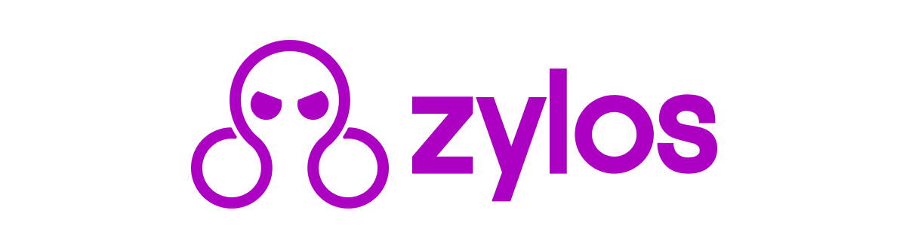

<p align="center">
  
</p>

<h1 align="center">zylos-lark-group-digest</h1>

<p align="center">
  Automated Lark group message digest for Zylos agents
</p>

<p align="center">
  <a href="./LICENSE"></a>
  <a href="https://nodejs.org/"></a>
  <a href="https://discord.gg/GS2J39EGff"></a>
  <a href="https://x.com/ZylosAI"></a>
  <a href="https://zylos.ai"></a>
  <a href="https://openmax.com"></a>
</p>

---

- **Scheduled digests** — configurable schedule (default: 3x daily at 08:00, 13:00, 19:00 local time)
- **Full message coverage** — text, images (with content inspection), files, rich text, cards
- **Auto-discovery** — dynamically fetches all groups the bot belongs to via Lark API; no manual group list needed
- **Structured summaries** — one-line items per group, owner attention board, configurable attention rules
- **Canonical HTML template** — collapsible panels, status pills, TL;DR cards, responsive design
- **Sensitive-info scanning** — configurable regex patterns to catch leaked IDs before publish
- **Config-driven** — no hardcoded IDs, tokens, or names; all runtime configuration
- **Auto-scheduling** — registers scheduler tasks automatically on install

## Install

```bash
zylos add lark-group-digest
```

Or manually:

```bash
cd ~/zylos/.claude/skills
git clone https://github.com/zylos-ai/zylos-lark-group-digest.git lark-group-digest
cd lark-group-digest && npm install
```

## Configuration

Edit `~/zylos/components/lark-group-digest/config.json`:

```json
{
  "owner_chat_id": "<lark-dm-chat-id>",
  "owner_display_name": "<name>",
  "lark_skill_path": "~/zylos/.claude/skills/lark",
  "output_dir": "~/zylos/lark-group-digest/raw",
  "pages_dir": "~/zylos/http/public/pages/daily-digest"
}
```

Key settings:

| Setting | Purpose |
|---------|---------|
| `owner_chat_id` | Lark DM chat ID for digest notifications (required) |
| `owner_display_name` | Name used in attention-item rules |
| `lark_skill_path` | Path to lark component (auto-detected) |
| `digest_schedule` | Array of `{hour, suffix, label, window_hours}` |
| `attention_rules.recruitment_groups` | Group names where new resumes always flag as owner action items |
| `sensitive_patterns` | Regex patterns for the desensitization scan |

## Usage

The component auto-registers three scheduler tasks on install:

| Task | Local Time | Window |
|------|-----------|--------|
| `lark-group-digest-morning` | 08:00 | Previous day 19:00 → now |
| `lark-group-digest-midday` | 13:00 | Today 08:00 → now |
| `lark-group-digest-evening` | 19:00 | Today 13:00 → now |

Cron expressions use the agent's configured timezone (from `.env TZ`).

The AI agent executes the full workflow: fetch messages → inspect images → summarize → build HTML → publish → notify owner.

## Scripts

| Script | Purpose |
|--------|---------|
| `scripts/digest.mjs` | Fetch and format messages from Lark groups |
| `scripts/pagination.mjs` | Generic token-based API pagination |

## Design Notes

Development-time architecture notes live in [docs/DESIGN.md](./docs/DESIGN.md).

## Built by OpenMax

Zylos is the open-source core of [OpenMax](https://openmax.com/) — the AI employee platform.

## License

[MIT](./LICENSE)
